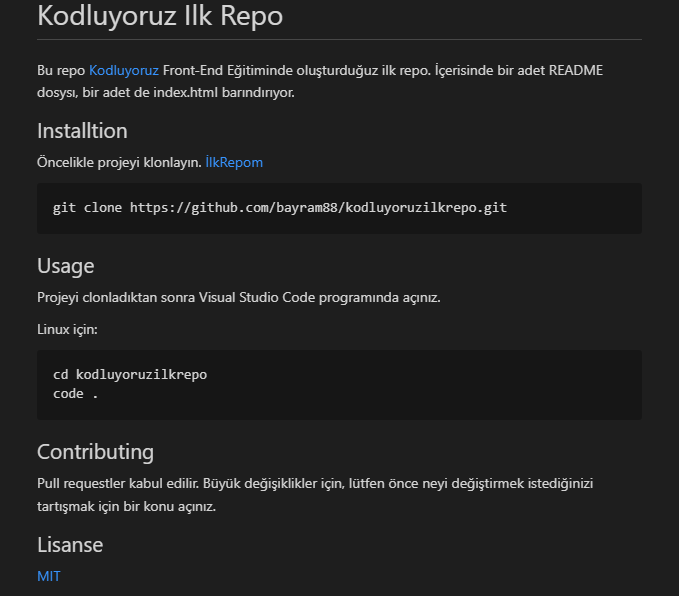

# Kodluyoruz Ilk Repo
Bu repo [Kodluyoruz](https://www.kodluyoruz.org/) Front-End Eğitiminde oluşturduğuz ilk repo. İçerisinde bir adet README dosysı, bir adet de index.html barındırıyor.

## Installtion 

Öncelikle projeyi klonlayın. [Kodluyoruz Ilk Repo](https://github.com/bayram88/kodluyoruzilkrepo.git)

```
git clone https://github.com/bayram88/kodluyoruzilkrepo.git
```
## Usage

Projeyi clonladıktan sonra Visual Studio Code programında açınız.

Linux için: 

```
cd kodluyoruzilkrepo
code .
```

## Contributing 

Pull requestler kabul edilir. Büyük değişiklikler için, lütfen önce neyi değiştirmek istediğinizi tartışmak için bir konu açınız.  

## Lisanse

[MIT](https://github.com/bayram88/kodluyoruzilkrepo/blob/main/LICENSE)

## Image
Markdown ile oluşturduğum dosyanın resmi:

 